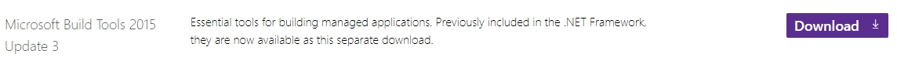

# Pychar Precautions(verson3.8)
### This document will introduce Which difficulties I encountered in pycharm and how to solve it 

## Install Scrapy
```python
pip install Scrapy
```
### you may meet error like:
```python
error: Microsoft Visual C++  14.0 is required. Get it with "Microsoft Visual C++ Build Tools": http://landinghub.visualstudio.com/visual-cpp-build-tools
```

## Three solutions
* Download Anaconda and install Scrapy
* Go to pycharm available packages to install
* Download Twisted(most people)

But when i Download Twisted and install
```python
error:***.whl  is not a supported wheel on this platform
```
So i suggest the most fastest and efficient method is to download Microsoft Build Tools 2015 Update 3




